# ESP32

In this chapter we'll cover the basics of ESP32, and by using different communication techniques we can build interactive applications combining computer and ESP32 interaction.

## What's ESP32?

The ESP32 is a low-cost, low-power system on a chip (SoC) microcontroller with integrated Wi-Fi and dual-mode Bluetooth. It is developed by Espressif Systems, a Chinese company based in Shanghai. The ESP32 is widely used in IoT (Internet of Things) applications due to its versatility, affordability, and ease of use. It is popular among hobbyists, makers, and professionals for building connected devices and applications.

Our goal in this chapter is to get familiar with the ESP32 platform, and explore different communication techniques between a web page and the ESP32 board. You can read input from different kinds of sensors (push buttons, light sensors, temperature sensors, gyroscopes, distance sensors, ...) and control other electronics (leds, motors, ...)

## Installation and setup

We will be using the Arduino IDE to program our ESP32 board. The Arduino IDE is a free, open-source software that makes it easy to write code and upload it to microcontroller boards.

You can download the Arduino IDE at https://www.arduino.cc/en/software/

The board we're using in this chapter is an ESP32 S3 N16R8 board. This particular board has 2 USB-C ports, an onboard RGB led and lots of GPIO pins to connect sensors and other electronics to. It has built-in WiFi, Bluetooth capabilities and can emulate a keyboard and mouse as well.

### Setting up the Arduino IDE for ESP32

1. Open the Arduino IDE.
2. Go to `Tools > Board > Board Manager`.
3. In the Board Manager window, search for "ESP32" and install the "esp32" package by Espressif Systems.

### Hello World

We'll do a first quick test of your ESP32 board and the IDE. Open op the Arduino IDE. You'll be presented with a screen like the image below: 


It consists of a large text area where you'll write your code, a button bar on top, a logging area below and a status bar.

We will try to blink an on-board LED on our Arduino.

1.  Copy / Paste the following code into our IDE:

```c
#include <Adafruit_NeoPixel.h>
Adafruit_NeoPixel LED_RGB(1, 48, NEO_GRBW + NEO_KHZ800);
void setup() {
  LED_RGB.begin();
  LED_RGB.setBrightness(158);
}
void loop() {
  LED_RGB.setPixelColor(0, uint32_t(LED_RGB.Color(255, 0, 0)));
  LED_RGB.show();
  delay(250);
  LED_RGB.setPixelColor(0, uint32_t(LED_RGB.Color(0, 255, 0)));
  LED_RGB.show();
  delay(250);
  LED_RGB.setPixelColor(0, uint32_t(LED_RGB.Color(0, 0, 255)));
  LED_RGB.show();
  delay(250);
}
```

2.  Connect the ESP32-S3 board through USB-C cable, on the board use the top left USB-C connection.
3.  Click on the combobox next to the circular buttons in the top left corner of the IDE. Choose `Select other board and port...`

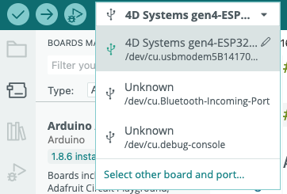

4.  Find our board in the list (you can filter on r8n16 to find it quickly), and select the correct port (will start with /dev/cu.usbmodem) as well.

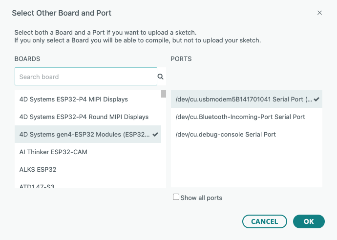

5.  Click on the right-pointing arrow button to upload the Sketch to the board.

You'll probably get an error on the Neopixel library. We will need to install this library first:

1. Go to `Sketch > Include Library > Manage Libraries...`
2. In the Library Manager window, search for "Adafruit NeoPixel" and install the library by Adafruit.

Try uploading the sketch again.

If everything works as it should, you should see the onboard LED blink in different colors!


Take a look at the code from this example. The language you write Arduino code in is the C programming language. We can identify a couple of parts in this Sketch:

- `void setup()`: The code in this function only runs once at startup of the program
- `void loop()`: The code in this function runs continuously. As soon as this function exits, it runs again. You can interpret this as some sort of endless loop.
- `delay`: This function pauses the execution of the program for a given amount of time in milliseconds.

## A first electrical circuit

Let's spice things up a little bit. Instead of blinking the on board LED, we'll connect a real LED to our board.

To make an LED light up, it'll need electricity running through it. That electric current needs to flow from somewhere to a destination. Just like water in a river, it will flow from a high potential to a low potential. You'll need to be careful about the amount of current flowing through the LED at any given time. Just like with the river analogy, too much current / pressure might destroy a component (our LED). We will add a resistor to our circuit, to limit the current.

We've used a couple of terms in the paragraph above, which are expressed in different units:

- Voltage (V): the difference between the high and low potential in a circuit, expressed in Volts.
- Current (I): the amount of current flowing in a circuit, expressed in Ampere.
- Resistance (R): a resistance in a circuit, expressed in Ohms.

There is a close connection between these 3, expressed in Ohm's law. As you can read on the [Wikipedia page on Ohm's law](https://en.wikipedia.org/wiki/Ohm's_law): "Ohm's law states that the current through a conductor between two points is directly proportional to the voltage across the two points."


Where I stands for current, V for voltage and R for resistance.

### An LED in a circuit

When we want to connect an LED to our board, we'd hook up the short side to a ground pin (GND) and the long side through a resistor to an output pin:

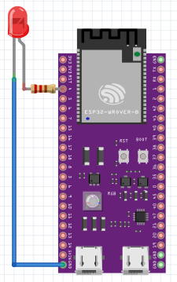

A lot of examples you'll find in the Arduino IDE or in online resources are shown with an Arduino UNO board. As we're using an ESP32 board, you'll need to look for the same pin numbers or pins with the same functionality on your board:


We could get our hands dirty with a soldering iron, and melt wires and components together, but this would be a pretty slow prototyping / testing proces. Instead of that, we'll use a breadboard.

Breadboards make it easier to prototype electronic circuits. Make sure to [read the chapter "Anatomy of a breadboard" on the Sparkfun website](https://learn.sparkfun.com/tutorials/how-to-use-a-breadboard/#anatomy-of-a-breadboard) before continuing.

Build the circuit below using a breadboard and test the code below (make sure the pin number in your code and the physical pin number match). The LED should turn on and off.

```c
const int ledPin = 4;

void setup() {
  pinMode(ledPin, OUTPUT);
}

void loop() {
  digitalWrite(ledPin, HIGH);
  delay(500);
  digitalWrite(ledPin, LOW);
  delay(500);
}
```

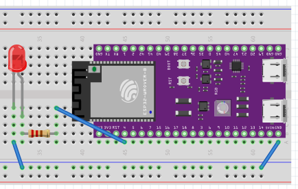

If it doesn't, check the following potential issues:

- The long connector from the LED should be connected to pin 4.
- The resistor should have a value below 1000 Ohms (1 KOhm). Resistance values can be read using the colored stripes on them (see [resistor-calculator.com](http://www.resistor-calculator.com/)). The one in the picture is a 220 Ohm resistor.

## Reading a potentiometer

A potentiometer is a variable resistor: by turning the knob, you change the resistance value. This will change the voltage drop over the potentiometer, which we can read using an analog input pin on our board.

A typical potentiometer has 3 pins:
- one pin connected to GND
- one pin connected to VCC (3.3V or 5V)
- one pin connected to the analog input pin on your board

Hook up the potentiometer to port 7.

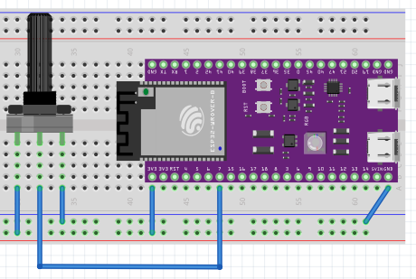

Setup a basic arduino sketch, which will read the analog values from the potentiometer and log them to the Serial monitor.

```c++
const int sensorPin = 7;

void setup() {
  Serial.begin(115200);
  while (!Serial) continue;
}

void loop() {
  int value = analogRead(sensorPin);
  Serial.print(value);
  Serial.println();
  delay(100);
}
```

Upload the sketch and open up the Serial monitor (`Tools > Serial Monitor`), make sure the baud rate is set to 115200. You should see values between 0 and 4095 being logged when turning the potentiometer.

Not seeing any values? Make sure that USB CDC On Boot is disabled & you are using the correct USB port.
1. Tools > USB CDC On Boot > Disabled
2. Upload sketch
3. Press reset button on the board

## Keyboard and Mouse Control

Our board has the capability of identifying itself as a keyboard and mouse. If all you need is basic input with some pushbuttons, this might be sufficient. Reading the input on your computer is as simple as just listening to keyboard / mouse events!

Let's play [the chrome dino game](chrome://dino) using your board. You can play this game by pressing the spacebar on your keyboard. We'll build our own keyboard!

- [Hook up a pushbutton to your board](https://www.arduino.cc/en/Tutorial/BuiltInExamples/Button). Ignore the code on that page, we'll be using our own code.
- Take a look at `File > Examples > Examples for 4D System etc... > USB > KeyboardAndMouseControl`. Figure out what you need to put in the pushbutton code to send out a spacebar key code when pressing the button.

You will need to switch USB ports after uploading the sketch, as the board will now identify itself as a keyboard / mouse.

## Serial Communication

To communicate between a computer (webpage) and our board we can use [Serial communication](https://www.arduino.cc/reference/en/language/functions/communication/serial/) and the [Web Serial API](https://caniuse.com/web-serial)

### Arduino Serial

There are a [lot of examples on the Arduino website](https://docs.arduino.cc/built-in-examples) that are using serial communication in some way or another.

Look for the Serial monitor in the Arduino IDE, open and Run `File > Examples > 04. Communication > ASCIITable` Can you see the ASCII table?

If you can't, make sure that USB CDC On Boot is disabled & you are using the correct USB port.

1. Tools > USB CDC On Boot > Disabled
2. Upload sketch
3. Press reset button

### Control RGB led through Serial

Let's try sending instructions to the Arduino using the Serial port.

#### Common Anode or Common Cathode?

There are two types of RGB LEDs: Common Anode and Common Cathode. The difference lies in how the LED is wired internally.

A Common Anode RGB LED has a shared positive (anode) connection for all three color channels (Red, Green, Blue). To control the individual colors, you connect the cathodes (negative terminals) of each color channel to ground through a resistor. By applying a LOW signal to a specific color channel, you complete the circuit and allow current to flow, causing that color to light up.

A Common Cathode RGB LED, on the other hand, has a shared negative (cathode) connection for all three color channels. To control the individual colors, you connect the anodes (positive terminals) of each color channel to a positive voltage source through a resistor. By applying a HIGH signal to a specific color channel, you complete the circuit and allow current to flow, causing that color to light up.

You can figure out if an LED is common anode or common cathode by testing it using a simple circuit. The longest leg of the LED is usually the common pin. Connect this pin to VCC (3.3V or 5V) and connect one of the other pins to ground through a resistor. If the LED lights up when you connect a color pin to ground, it's a common anode LED. If it lights up when you connect a color pin to VCC, it's a common cathode LED.

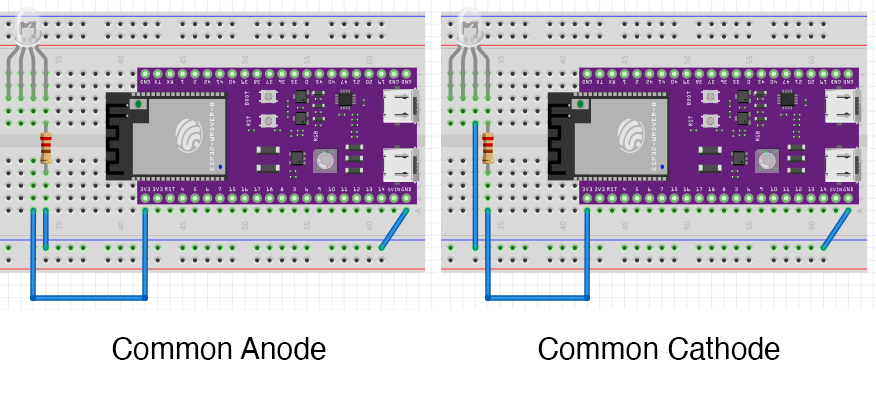

#### Common Cathode LED

Create the following circuit, using an RGB Common Cathode LED:

- red anode: digital pin 4 through 220 ohm resistor
- green anode: digital pin 5 through 220 ohm resistor
- blue anode: digital pin 6 through 220 ohm resistor
- cathode: GND

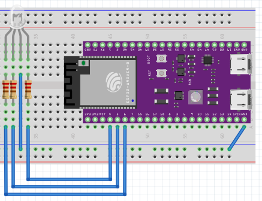

The goal is to control each individual color channel value through the Serial port.

Open `File > Examples > 04. Communication > ReadASCIIString` and explore the code. As we use a common cathode LED, we need to make one tweak to the source code (which is indicated in the source code):

Change

```diff
- red = 255 - constrain(red, 0, 255);
- green = 255 - constrain(green, 0, 255);
- blue = 255 - constrain(blue, 0, 255);

+ red = constrain(red, 0, 255);
+ green = constrain(green, 0, 255);
+ blue = constrain(blue, 0, 255);
```

Upload the sketch and open the Serial monitor. You should be able to pass 3 numbers between [0-255], separated by a comma to control the 3 color channels:


### Serial & JSON

When building more complex circuits and interactions, you might run into limitations of just sending comma separated numbers...

Let's add JSON parsing functionality to our Arduino sketch, with [the ArduinoJSON library](https://arduinojson.org).

Save the previous ReadASCIIString as a different sketch with the name `ArduinoJSONRGBLed`.

Open the Library Manager in your Arduino IDE, and search for ArduinoJson:


Click **install** and wait for the installation to finish.

Next up, in the menu bar, click on `Sketch > Include Library > Arduino Json` to add the necessary header files to your Arduino sketch.

This should add the following two lines at the top of your sketch:

```c
#include <ArduinoJson.h>
#include <ArduinoJson.hpp>
```

Replace the `loop()` function with the following content, which just reads a full serial string:

```c
void loop() {
  // if there's any serial available, read it:
  if (Serial.available() > 0) {
    String s = Serial.readStringUntil('\n');
    Serial.print("received: ");
    Serial.println(s);
    // todo: parse here
  }
}
```

Take a look at [the arduinojson docs](https://arduinojson.org/v6/doc/) on how to implement deserialization, and see if you can get it working so that sending json strings such as `{"r": 255, "g": 255, "b": 0}` works to control the LED.

### Web Serial API

Using the Web Serial API, you can access Serial devices from JavaScript.

We will use our previous Arduino sketch **ArduinoJSONRGBLed** for this first experiment.

A great place to start is [the MDN page on the Web Serial API](https://developer.mozilla.org/en-US/docs/Web/API/Web_Serial_API). Also [take a look at this step-by-step guide](https://developer.chrome.com/articles/serial/) for extra pointers in the right direction.

As mentioned in the docs, you can only use Web Serial within a secure browser context (aka: https). So, first of all, set up a nodejs project with express, which launches an https server - [See the WebRTC chapter for that](../webrtc/)

Next up, [follow the step-by-step article on the chrome website](https://developer.chrome.com/articles/serial/).

Create an index.html file in your public folder, and use some boilerplate code to get started:
- placeholder divs for the two different states of the app (supported / not supported)
- placeholder divs for the connection status (connected / disconnected)
- boolean to check whether the Web Serial API is supported
- boolean to check whether the serial port is connected
- methods to toggle the visibility of the different divs

```html
<!DOCTYPE html>
<html lang="en">
<head>
  <meta charset="UTF-8">
  <meta name="viewport" content="width=device-width, initial-scale=1.0">
  <title>Web Serial RGB LED</title>
  <style>
    body {
      font-family: -apple-system, BlinkMacSystemFont, 'Segoe UI', Roboto, sans-serif;
      max-width: 600px;
      margin: 50px auto;
      padding: 20px;
    }
    button {
      padding: 10px 20px;
      font-size: 16px;
      cursor: pointer;
      background-color: #007bff;
      color: white;
      border: none;
      border-radius: 5px;
    }
    button:hover {
      background-color: #0056b3;
    }
    button:disabled {
      background-color: #ccc;
      cursor: not-allowed;
    }
    .controls {
      margin-top: 20px;
      padding: 15px;
      background-color: #f5f5f5;
      border-radius: 5px;
    }
    .slider-group {
      margin-bottom: 20px;
    }
    .slider-group label {
      display: block;
      font-weight: bold;
      margin-bottom: 5px;
    }
    .slider-group input[type="range"] {
      width: 100%;
      height: 15px;
      border-radius: 8px;
      appearance: none;
      background: #ddd;
      outline: none;
    }
    .slider-group input[type="range"]::-webkit-slider-thumb {
      appearance: none;
      width: 25px;
      height: 25px;
      border-radius: 50%;
      cursor: pointer;
    }
    #r::-webkit-slider-thumb { background: #dc3545; }
    #g::-webkit-slider-thumb { background: #28a745; }
    #b::-webkit-slider-thumb { background: #007bff; }
    .slider-value {
      text-align: right;
      font-family: monospace;
      font-size: 14px;
      color: #666;
    }
    .status {
      padding: 10px;
      margin: 10px 0;
      border-radius: 5px;
    }
    .status.connected {
      background-color: #d4edda;
      color: #155724;
    }
    .status.disconnected {
      background-color: #f8d7da;
      color: #721c24;
    }
    .color-preview {
      width: 100%;
      height: 80px;
      border-radius: 8px;
      margin-top: 20px;
      border: 2px solid #ccc;
      transition: background-color 0.1s;
    }
  </style>
</head>
<body>
  <div id="app">
    <h1>Web Serial RGB LED</h1>
    <div id="not-supported">
      <p>⚠️ Web Serial is not supported in this browser.</p>
      <p>Please use Chrome or Edge on desktop.</p>
    </div>
    <div id="supported">
      <div id="not-connected">
        <p class="status disconnected">Not connected</p>
      </div>
      <div id="connected">
        <p class="status connected">✓ Connected to Board</p>
      </div>
    </div>
  </div>
  <script type="module">

    // app state
    const hasWebSerial = "serial" in navigator;
    let isConnected = false;

    const $notSupported = document.getElementById("not-supported");
    const $supported = document.getElementById("supported");
    const $notConnected = document.getElementById("not-connected");
    const $connected = document.getElementById("connected");

    const init = async () => {
      displaySupportedState();
      if (!hasWebSerial) return;
      displayConnectionState();
    };

    const displaySupportedState = () => {
      if (hasWebSerial) {
        $notSupported.style.display = "none";
        $supported.style.display = "block";
      } else {
        $notSupported.style.display = "block";
        $supported.style.display = "none";
      }
    };

    const displayConnectionState = () => {
      if (isConnected) {
        $notConnected.style.display = "none";
        $connected.style.display = "block";
      } else {
        $notConnected.style.display = "block";
        $connected.style.display = "none";
      }
    };

    init();

  </script>
</body>
</html>
```

At time of writing, only Chrome, Edge and Opera supported the Web Serial API, so make sure to use one of those browsers. The early `return` in the init function will make sure that the app doesn't run in other browsers.

As [seen on the MDN Web Serial API](https://developer.mozilla.org/en-US/docs/Web/API/Web_Serial_API) page, we can get a list of available ports using the `navigator.serial.getPorts()` method, and keep track of connected ports using the `navigator.serial.addEventListener('connect')` and `navigator.serial.addEventListener('disconnect')` methods.

Add the following logic to our `init()` function:

```javascript
const ports = await navigator.serial.getPorts();

console.log('Ports');
ports.forEach(port => {
  const info = port.getInfo();
  console.log(info);
});
```

Run the app, with your arduino connected. We don't see any ports logged yet: this is because we need to request access to the port first, using the `navigator.serial.requestPort()` method.

Try adding the requestPort method at the end of the init() function, and run the app again. This doesn't work either: we get an error in our console:

> Uncaught (in promise) DOMException:
> The requestPort() method must be called in response to a user gesture.

The method `Serial.requestPort()` must be called on a user interaction. This is why we have a button on our page.

Add a button to the `not-connected` div (doing it in the html is fine, as we toggle the div visibility), and attach a click event listener to it:

```html
<button id="connectButton">Connect to Serial Device</button>
```

```javascript
const $connectButton = document.getElementById("connectButton");
$connectButton.addEventListener("click", handleClickConnect);
```

```javascript
const handleClickConnect = async () => {
  const port = await navigator.serial.requestPort();
  console.log(port);
  const info = port.getInfo();
  console.log(info);
};
```

Test the button: you should see a browser dialog to select a port, after selecting the port, you should see some general information.

> There can be only one serial connection at a time. Remember this when you're trying to upload a new sketch while a browser is already connected to the serial port or when the Serial monitor is open in the Arduino IDE...

Once we have a port, we can setup our serial connection, using the same baudRate we specified in our Arduino sketch. Make sure to update the connection status boolean, and toggle the visibility of the divs:

```javascript
isConnected = true;
displayConnectionState();
await port.open({ baudRate: 115200 });
```

A serial port sends `Uint8Array` objects over the wire. To convert our JSON strings to these arrays, we'll use an additional TextEncoder:

```javascript
const textEncoder = new TextEncoderStream();
const writableStreamClosed = textEncoder.readable.pipeTo(port.writable);
const writer = textEncoder.writable.getWriter();
```

We can then use this write object, to send the serial strings. For example, let's send a random color json every second:

```javascript
setInterval(async () => {
  await writer.write(JSON.stringify({
    r: Math.floor(Math.random()*255),
    g: Math.floor(Math.random()*255),
    b: Math.floor(Math.random()*255),
  }));
  await writer.write("\n");
}, 1000);
```

**note the additional line break `\n` - do you know why we are adding this? Hint: take a look at our Arduino sketch...**

Test the app - the RGB led should change color every second.

Listen for the `disconnected` event on the port, and toggle the connect button visibility. Try unplugging the arduino while the app is running, to check if everything remains stable.

```javascript
port.addEventListener("disconnect", () => {
  console.log("Disconnected");
  isConnected = false;
  displayConnectionState();
});
```

Now that we have a port linked to our app, you'll notice that the port logging logic in the `init()` function is also triggered. We can now add some extra, auto-connect logic to our app.

Move the connection logic (setting up the baudRate, stream writer and disconnect logic) to a separate connect function, and call that function from the `handleClickConnect` function:

```javascript
const handleClickConnect = async () => {
  const port = await navigator.serial.requestPort();
  console.log(port);
  const info = port.getInfo();
  console.log(info);
  await connect(port);
};

const connect = async (port) => {
  isConnected = true;
  displayConnectionState();

  await port.open({ baudRate: 115200 });

  const textEncoder = new TextEncoderStream();
  const writableStreamClosed = textEncoder.readable.pipeTo(port.writable);
  const writer = textEncoder.writable.getWriter();
  setInterval(async () => {
    await writer.write(JSON.stringify({
      r: Math.floor(Math.random()*255),
      g: Math.floor(Math.random()*255),
      b: Math.floor(Math.random()*255),
    }));
    await writer.write("\n");
  }, 1000);

  port.addEventListener("disconnect", () => {
    console.log("Disconnected");
    isConnected = false;
    displayConnectionState();
  });
}
```

At the end of our init function, where we have a list of ports, we can now also check if we have a port available, and connect to it automatically. Make sure to filter on the correct usbProductId and usbVendorId, we've been logging those in the console already.

```javascript
// global boardSettings
const boardSettings = {usbProductId: 21971, usbVendorId: 6790};
```

```javascript
const arduinoPorts = ports.filter(port => {
  const info = port.getInfo();
  return info.usbProductId === boardSettings.usbProductId &&
          info.usbVendorId === boardSettings.usbVendorId;
});

console.log('Arduino Ports', arduinoPorts);
if (arduinoPorts.length > 0) {
  await connect(arduinoPorts[0]);
}
```

Run the app, and check if the connection is established automatically.

Let's make sure we can unplug / replug the arduino, and the app will reconnect automatically.

In our connect handler, we can now call this same connect function when no connection is active yet:

```javascript
navigator.serial.addEventListener('connect', (e) => {
  const port = e.target;
  const info = port.getInfo();
  console.log('connect', port, info);
  if (info.usbProductId === boardSettings.usbProductId &&
      info.usbVendorId === boardSettings.usbVendorId) {
    connect(port);
  }
});
```

Change the app, and try controlling the RGB color using a color picker or sliders. You will probably need to move the port, writableStreamClosed and writer to the global scope.

## Reading sensor values over web serial

Let's try sending sensor values from our board to our web page. 

On [web serial mdn page](https://developer.mozilla.org/en-US/docs/Web/API/Web_Serial_API#reading_data_from_a_port) there's a code snippet which deals with reading values from the serial port. We can use this as a starting point for our app.

Create a copy of the previous exercise, get rid of the text encoder and writer, and replace it with the code snippet from the MDN page (add a log statement to log the value);

```javascript
while (port.readable) {
  const reader = port.readable.getReader();
  try {
    while (true) {
      const { value, done } = await reader.read();
      if (done) {
        // |reader| has been canceled.
        break;
      }
      // Do something with |value|...
      console.log(value);
    }
  } catch (error) {
    // Handle |error|...
  } finally {
    reader.releaseLock();
  }
}
```

You should see a bunch of `Uint8Array` values logged in the console. We can use the `TextDecoder` to convert these values to a string. Setup the reader as follows (instead of setting it equal to `port.readable.getReader();`)

```javascript
const decoder = new TextDecoderStream();
const readableStreamClosed = port.readable.pipeTo(decoder.writable);
const reader = decoder.readable.getReader();
```

This now logs the values as strings. If you pay close attention, you'll notice that it doesn't take the line breaks into account: it seems to read a random places in the string...

We will need to "transform" the stream in order to be able to use it in our JavaScript code. We can use [the `TransformStream`](https://developer.mozilla.org/en-US/docs/Web/API/Streams_API/Concepts) for this to split the incoming string into lines.

```javascript
const lineBreakTransformer = new TransformStream({
  transform(chunk, controller) {
    const text = chunk;
    const lines = text.split("\n");
    lines[0] = (this.remainder || "") + lines[0];
    this.remainder = lines.pop();
    lines.forEach((line) => controller.enqueue(line));
  },
  flush(controller) {
    if (this.remainder) {
      controller.enqueue(this.remainder);
    }
  },
});
```

Update the reader to use this stream:

```javascript
const readableStreamClosed = port.readable.pipeTo(decoder.writable);
const inputStream = decoder.readable.pipeThrough(lineBreakTransformer);
const reader = inputStream.getReader();
```

The logs should now be split into lines. We can now use the `JSON.parse` function to parse the JSON string into a JavaScript object.

```javascript
// Do something with |value|...
try {
  const json = JSON.parse(value);
  console.log(json);
} catch (error) {
  console.log(error);
}
```

Do further json processing so that you can see the values in your browser.

## Reading + Writing over Web Serial

We'll now combine both reading and writing over Web Serial in one application. To reduce boilerplate code, we will extract the serial communication logic to a separate module.

Create a new file `js/serial.js` and create a custom WebSerial class in there:

```javascript
/**
 * Web Serial Module
 * A reusable module for handling Web Serial communication with Arduino/ESP32 devices
 */

export class WebSerial extends EventTarget {
  static isSupported = "serial" in navigator;

  #port = null;
  #reader = null;
  #writer = null;
  #readableStreamClosed = null;
  #writableStreamClosed = null;
  #keepReading = false;
  #isConnected = false;
  #knownPorts = [];

  #options = {
    usbVendorId: null,
    usbProductId: null,
    baudRate: 115200,
    autoConnect: true,
    autoReconnect: true,
  };

  /**
   * Create a new WebSerial instance
   * @param {Object} options - Configuration options
   * @param {number} options.usbVendorId - USB Vendor ID to filter devices
   * @param {number} options.usbProductId - USB Product ID to filter devices
   * @param {number} [options.baudRate=115200] - Baud rate for serial connection
   * @param {boolean} [options.autoConnect=true] - Automatically connect to known devices on init
   * @param {boolean} [options.autoReconnect=true] - Automatically reconnect when device is plugged back in
   */
  constructor(options = {}) {
    super();
    this.#options = { ...this.#options, ...options };
  }

  /**
   * Check if Web Serial API is supported
   * @returns {boolean}
   */
  get isSupported() {
    return WebSerial.isSupported;
  }

  /**
   * Check if currently connected
   * @returns {boolean}
   */
  get isConnected() {
    return this.#isConnected;
  }

  /**
   * Initialize the serial module - call this on page load
   * Sets up event listeners and optionally auto-connects
   */
  async init() {
    if (!this.isSupported) {
      this.#emit("error", { message: "Web Serial is not supported in this browser" });
      return;
    }

    // Listen for new devices being connected
    navigator.serial.addEventListener("connect", (e) => {
      const port = e.target;
      console.log("[WebSerial] Device connected", port.getInfo());
      
      if (this.#isMatchingPort(port)) {
        if (!this.#knownPorts.includes(port)) {
          this.#knownPorts.push(port);
        }
        // Auto-reconnect if enabled and not currently connected
        if (this.#options.autoReconnect && !this.#isConnected) {
          this.connect(port);
        }
      }
    });

    // Listen for devices being disconnected
    navigator.serial.addEventListener("disconnect", (e) => {
      const port = e.target;
      console.log("[WebSerial] Device disconnected", port.getInfo());
      this.#knownPorts = this.#knownPorts.filter((p) => p !== port);
    });

    // Get already known/permitted ports
    const ports = await navigator.serial.getPorts();
    this.#knownPorts = ports.filter((port) => this.#isMatchingPort(port));

    console.log("[WebSerial] Known matching ports:", this.#knownPorts.length);

    // Auto-connect if enabled and we have a known port
    if (this.#options.autoConnect && this.#knownPorts.length > 0) {
      await this.connect(this.#knownPorts[0]);
    }
  }

  /**
   * Request a port from the user (triggers browser's device picker)
   * Use this when the user clicks a "Connect" button
   * @returns {Promise<boolean>} - Whether connection was successful
   */
  async requestPort() {
    if (!this.isSupported) {
      this.#emit("error", { message: "Web Serial is not supported" });
      return false;
    }

    try {
      const filters = [];
      if (this.#options.usbVendorId && this.#options.usbProductId) {
        filters.push({
          usbVendorId: this.#options.usbVendorId,
          usbProductId: this.#options.usbProductId,
        });
      }

      const port = await navigator.serial.requestPort(
        filters.length > 0 ? { filters } : undefined
      );
      
      return await this.connect(port);
    } catch (error) {
      if (error.name === "NotFoundError") {
        // User cancelled the picker
        console.log("[WebSerial] User cancelled port selection");
      } else {
        console.error("[WebSerial] Error requesting port:", error);
        this.#emit("error", { message: error.message, error });
      }
      return false;
    }
  }

  /**
   * Connect to a specific port
   * @param {SerialPort} port - The port to connect to
   * @returns {Promise<boolean>} - Whether connection was successful
   */
  async connect(port) {
    if (this.#isConnected) {
      console.log("[WebSerial] Already connected");
      return true;
    }

    try {
      this.#port = port;
      this.#keepReading = true;

      await port.open({ baudRate: this.#options.baudRate });

      // Set up disconnect handler
      port.addEventListener("disconnect", () => {
        console.log("[WebSerial] Port disconnected");
        this.#handleDisconnect();
      });

      // Set up writer
      const textEncoder = new TextEncoderStream();
      this.#writableStreamClosed = textEncoder.readable.pipeTo(port.writable);
      this.#writer = textEncoder.writable.getWriter();

      // Set up reader with line-break transformer
      const textDecoder = new TextDecoderStream();
      this.#readableStreamClosed = port.readable.pipeTo(textDecoder.writable);

      const lineBreakTransformer = new TransformStream({
        transform(chunk, controller) {
          const text = chunk;
          const lines = text.split("\n");
          lines[0] = (this.remainder || "") + lines[0];
          this.remainder = lines.pop();
          lines.forEach((line) => controller.enqueue(line));
        },
        flush(controller) {
          if (this.remainder) {
            controller.enqueue(this.remainder);
          }
        },
      });

      const inputStream = textDecoder.readable.pipeThrough(lineBreakTransformer);
      this.#reader = inputStream.getReader();

      this.#isConnected = true;
      this.#emit("connect", { port });

      // Start reading loop
      this.#readLoop();

      return true;
    } catch (error) {
      console.error("[WebSerial] Connection error:", error);
      this.#emit("error", { message: error.message, error });
      this.#cleanup();
      return false;
    }
  }

  /**
   * Disconnect from the current port
   */
  async disconnect() {
    if (!this.#port) {
      return;
    }

    this.#keepReading = false;

    // Cancel reader
    if (this.#reader) {
      try {
        await this.#reader.cancel();
      } catch (e) {
        // Ignore cancel errors
      }
      this.#reader = null;
    }

    // Close writer
    if (this.#writer) {
      try {
        await this.#writer.close();
      } catch (e) {
        // Ignore close errors
      }
      this.#writer = null;
    }

    // Wait for streams to close
    if (this.#readableStreamClosed) {
      try {
        await this.#readableStreamClosed;
      } catch (e) {
        // Ignore stream closed errors
      }
      this.#readableStreamClosed = null;
    }

    if (this.#writableStreamClosed) {
      try {
        await this.#writableStreamClosed;
      } catch (e) {
        // Ignore stream closed errors
      }
      this.#writableStreamClosed = null;
    }

    // Close port
    try {
      await this.#port.close();
    } catch (e) {
      // Ignore close errors
    }

    this.#port = null;
    this.#isConnected = false;
    this.#emit("disconnect", {});
  }

  /**
   * Send a string to the connected device
   * @param {string} data - The string to send
   * @returns {Promise<boolean>} - Whether the send was successful
   */
  async send(data) {
    if (!this.#isConnected || !this.#writer) {
      console.warn("[WebSerial] Cannot send: not connected");
      return false;
    }

    try {
      await this.#writer.write(data);
      return true;
    } catch (error) {
      console.error("[WebSerial] Send error:", error);
      this.#emit("error", { message: error.message, error });
      return false;
    }
  }

  /**
   * Send a string followed by a newline
   * @param {string} data - The string to send
   * @returns {Promise<boolean>} - Whether the send was successful
   */
  async sendLine(data) {
    return this.send(data + "\n");
  }

  /**
   * Send an object as JSON followed by a newline
   * @param {Object} data - The object to send as JSON
   * @returns {Promise<boolean>} - Whether the send was successful
   */
  async sendJSON(data) {
    return this.sendLine(JSON.stringify(data));
  }

  // Private methods

  #isMatchingPort(port) {
    const info = port.getInfo();
    
    // If no filter specified, match all ports
    if (!this.#options.usbVendorId && !this.#options.usbProductId) {
      return true;
    }

    return (
      info.usbVendorId === this.#options.usbVendorId &&
      info.usbProductId === this.#options.usbProductId
    );
  }

  async #readLoop() {
    try {
      while (this.#keepReading) {
        const { value, done } = await this.#reader.read();
        if (done) {
          break;
        }
        if (value) {
          this.#emit("data", { data: value });
        }
      }
    } catch (error) {
      if (this.#keepReading) {
        console.error("[WebSerial] Read error:", error);
        this.#emit("error", { message: error.message, error });
      }
    } finally {
      try {
        this.#reader?.releaseLock();
      } catch (e) {
        // Ignore
      }
      this.#reader = null;
    }
  }

  #handleDisconnect() {
    this.#keepReading = false;
    this.#isConnected = false;
    this.#port = null;
    this.#reader = null;
    this.#writer = null;
    this.#emit("disconnect", {});
  }

  #cleanup() {
    this.#port = null;
    this.#reader = null;
    this.#writer = null;
    this.#readableStreamClosed = null;
    this.#writableStreamClosed = null;
    this.#isConnected = false;
    this.#keepReading = false;
  }

  #emit(eventName, detail) {
    this.dispatchEvent(new CustomEvent(eventName, { detail }));
  }
}

export default WebSerial;
```

This class can now be used to easily set up Web Serial communication in your projects. Doing both reading, writing and auto (re)connecting is as simple as this:

```javascript
import { WebSerial } from './js/serial.js';

const serial = new WebSerial({
  usbVendorId: 6790,
  usbProductId: 21971,
  autoConnect: true,
  autoReconnect: true,
});

// Listen for incoming data
serial.addEventListener('data', (e) => {
  const line = e.detail.data;
  try {
    const json = JSON.parse(line);
    console.log('Received:', json);
  } catch (err) {
    console.log('Received raw:', line);
  }
});

// Track connection state
serial.addEventListener('connect', () => {
  document.getElementById('connected').style.display = 'block';
  document.getElementById('not-connected').style.display = 'none';
});

serial.addEventListener('disconnect', () => {
  document.getElementById('connected').style.display = 'none';
  document.getElementById('not-connected').style.display = 'block';
});

// Send data example
document.getElementById('sendButton').addEventListener('click', () => {
  serial.sendJSON({ command: 'led', value: 255 });
});

serial.init();
```

Combine both the RGB Led control and potentiometer reading examples into one app, using this WebSerial module.

### Fixing Lag

You'll notice that the RGB Led is not responding that well when you turn the potentiometer. This is because we have delay() calls in our Arduino sketch, blocking the serial reading. Luckely, we can circumvent this by using `millis()` based timing instead of delay.

Take a look at the `File > Examples > 02.Digital > BlinkWithoutDelay` example in the Arduino IDE to learn how to implement this non-blocking timing mechanism.

## Bluetooth with the ESP32

Our ESP32 board also has bluetooth low energy (BLE) capabilities. This allows us to set up wireless communication with our board, without the need for any wires or serial connections.

Before we get started, there is some basic terminology to cover:
- **GATT (Generic Attribute Profile)**: A protocol for communication between BLE devices. It defines how data is organized and exchanged.
- **Services**: Collections of characteristics that define a specific functionality or feature of a BLE device.
- **Characteristics**: Individual data points within a service. They can be read, written, or notified.
- **UUID (Universally Unique Identifier)**: A unique identifier for services and characteristics.

Basically, a BLE device (like our ESP32) can have multiple services. Each service has a unique UUID and each service can have multiple characteristics. Each characteristic also has a unique UUID. We will use a BLE **characteristic** per sensor or output we want to read or control. This means we won't need JSON parsing or complex serial communication - we can just read and write values directly to the characteristics.

### Preventing chaos in class

When multiple ESP32 boards are in range, it can be hard to figure out which device is which. To prevent chaos in class, you will need to use a unique name for your board. You'll do this in your Arduino sketch.

### BLE RGB Led

Let's hook up a RGB Led to our ESP32, and control it over BLE.

Start with the following base sketch - **make sure to set a unique DEVICE_NAME for your board, or it will be hard to find your board when multiple boards are in range!**

```c
#include <BLEDevice.h>
#include <BLEServer.h>
#include <BLEUtils.h>

// Make sure to set a unique name for your device here:
#define DEVICE_NAME "BLE RGB Led"

// See the following for generating UUIDs:
// https://www.uuidgenerator.net/

#define SERVICE_UUID               "6e400001-b5a3-f393-e0a9-e50e24dcca9e"
#define CHARACTERISTIC_UUID_R      "6e400002-b5a3-f393-e0a9-e50e24dcca9e"

// pins for the LEDs:
const int redPin = 4;

BLEServer *pServer = NULL;
bool deviceConnected = false;
bool oldDeviceConnected = false;

class MyServerCallbacks : public BLEServerCallbacks {
  void onConnect(BLEServer *pServer) {
    deviceConnected = true;
    Serial.println("Device connected");
  };

  void onDisconnect(BLEServer *pServer) {
    deviceConnected = false;
    Serial.println("Device disconnected");
  }
};

class RedCallback : public BLECharacteristicCallbacks {
  void onWrite(BLECharacteristic *pCharacteristic) {
    String rxValue = pCharacteristic->getValue();
    if (rxValue.length() > 0) {
      uint8_t value = (uint8_t)rxValue[0];
      analogWrite(redPin, value);
      Serial.print("Red: ");
      Serial.println(value);
    }
  }
};

void setup() {
  Serial.begin(115200);

  // Set up LED pins
  pinMode(redPin, OUTPUT);

  // Create the BLE Device
  BLEDevice::init(DEVICE_NAME);

  // Create the BLE Server
  pServer = BLEDevice::createServer();
  pServer->setCallbacks(new MyServerCallbacks());

  // Create the BLE Service
  BLEService *pService = pServer->createService(SERVICE_UUID);

  BLECharacteristic *pRCharacteristic = pService->createCharacteristic(CHARACTERISTIC_UUID_R, BLECharacteristic::PROPERTY_WRITE | BLECharacteristic::PROPERTY_WRITE_NR);
  pRCharacteristic->setCallbacks(new RedCallback());

  // Start the service
  pService->start();

  // Start advertising
  BLEAdvertising *pAdvertising = BLEDevice::getAdvertising();
  pAdvertising->addServiceUUID(SERVICE_UUID);  // This is crucial for Web Bluetooth to find the device!
  pAdvertising->setScanResponse(true);
  pAdvertising->setMinPreferred(0x06);  // helps with iPhone connection issues
  pAdvertising->setMinPreferred(0x12);
  BLEDevice::startAdvertising();
  Serial.println("Waiting a client connection to notify...");
}

void loop() {
  // disconnecting
  if (!deviceConnected && oldDeviceConnected) {
    delay(500);                   // give the bluetooth stack the chance to get things ready
    BLEDevice::startAdvertising();  // restart advertising
    Serial.println("Started advertising again...");
    oldDeviceConnected = false;
  }
  // connecting
  if (deviceConnected && !oldDeviceConnected) {
    // do stuff here on connecting
    oldDeviceConnected = true;
  }
}
```

We'll now create a simple web page to control the red channel of the RGB led over BLE. It's actually a bit simpler than Web Serial, as we don't need to deal with serial ports, baud rates or JSON parsing. You will need to make sure your UDIDs in javascript match the ones in your Arduino sketch.

Here are the steps to connect to the BLE device and control the red channel:

```javascript
const bluetoothDevice = await navigator.bluetooth.requestDevice({
  filters: [{ services: [SERVICE_UUID] }],
});

const server = await bluetoothDevice.gatt.connect();
const service = await server.getPrimaryService(SERVICE_UUID);
const rCharacteristic = await service.getCharacteristic(CHARACTERISTIC_UUID_R);
```

Writing a value to the characteristic is as simple as this:

```javascript
await characteristic.writeValueWithoutResponse(new Uint8Array([value]));
```

Adjust the previous Serial RGB Led example to use BLE instead of Web Serial.

### BLE Sensor Data

We can also receive sensor data over BLE. For this, we will need to set up a characteristic with the `PROPERTY_NOTIFY` property. This allows the ESP32 to send updates to the connected client whenever the value changes.

In order to accomplish this, add a global BLECharacteristic pointer for the characteristic you want to notify on:

```c
BLEServer *pServer = NULL; // you already have this line
BLECharacteristic *pCharacteristicX = NULL; // but add this global pointer
```

Also add a unique UUID for the characteristic, and store the pin number in a global const. Also create a variable to hold the last sent value, to prevent sending duplicate notifications:

```c
#define CHARACTERISTIC_X_UUID      "6e400005-b5a3-f393-e0a9-e50e24dcca9e"

const int xPins = 15;
int prevX = 0;
```

In the setup function, create the characteristic with the notify property:

```c
pCharacteristicX = pService->createCharacteristic(
  CHARACTERISTIC_X_UUID,
  BLECharacteristic::PROPERTY_NOTIFY
);
```

In your loop function, read the sensor value, and if it has changed, send a notification:

```c
int xValue = analogRead(xPin);
// notify changed values
if (deviceConnected) {
  if (xValue != prevX) {
    pCharacteristicX->setValue((uint8_t *)&xValue, 4);
    pCharacteristicX->notify();
  }
  delay(50);
}
prevX = xValue;
```

#### Reading BLE notifications in JavaScript

To read notifications from a BLE characteristic in JavaScript, you need to set up an event listener for the `characteristicvaluechanged` event. Here's how you can do it:

```javascript
characteristicX = await service.getCharacteristic(CHARACTERISTIC_X_UUID);        
console.log('Starting Notifications...');
await characteristicX.startNotifications();

characteristicX.addEventListener('characteristicvaluechanged', (e) => handleNotification(e));
```

In the event handler, you can then read the value from the event target:

```javascript
const value = event.target.value;
// Read as 32-bit integer (little-endian) - matches 4-byte int
const potmeterValue = value.getInt32(0, true); // true = little-endian
```

Visualize this value in your web application, for example using a slider or a graph.

Finally, combine both the RGB Led control and potentiometer reading examples into one app, using BLE.

## Using 5V components with the ESP32

The ESP32 works on 3.3V logic levels, while many common components (like servos, ultrasonic sensors, etc) work on 5V logic levels. Connecting a 5V component directly to the ESP32 will not work properly, and can even damage your board.

To safely use 5V components with the ESP32, you can use a power module such as the MB102 power module that provides both a 5V (to power 5V components) and 3.3V (which we can use to power the ESP32 itself) output. If you take a closer look to the power module, you'll see that there are output voltage pins on both sides of the module, together with jumper pins to select which voltage to output on those pins.

Before hooking it up, make sure to set both jumpers to the OFF position, like you see in the image below:

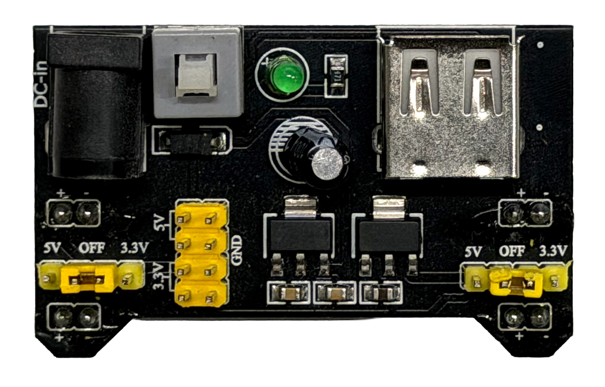

We'll use one side of our breadboard to work with 5V and the other side to work with 3.3V. It'll be crucial to keep these two voltage levels separated, to prevent damage to your board.

In the image below, we've hooked up the power module to the breadboard:

- On the power module, we used the jumpers to set the bottom rail to 3.3V, and the top rail to 5V:
- There is a wire connecting the 5V+ on the top rail of the breadboard to the 5Vin pin of the ESP32.
- There is a wire connecting the GND on the bottom rail of the breadboard to the GND pin of the ESP32.

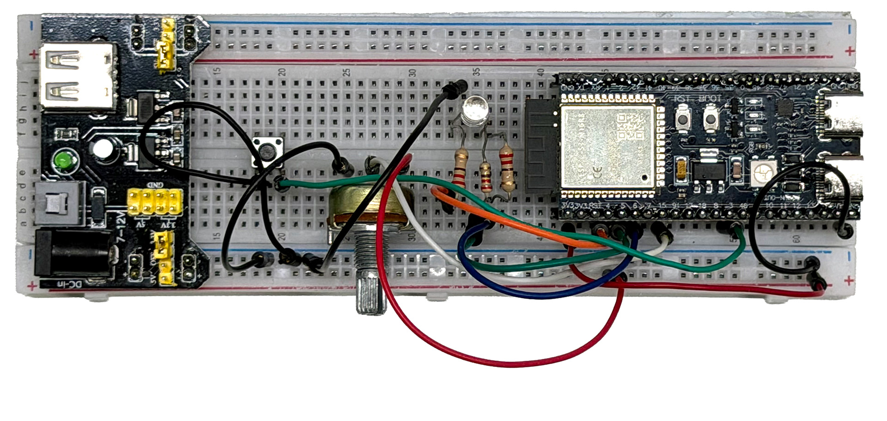

If you now plug in the power module to a 12V DC adapter, you should see the ESP32 power up correctly, even without USB power. You should be able to run the BLE RGB Led sketch as before, without any wired connection between your computer and the ESP32!

### Servo motor

A servo motor is a motor that can be controlled to move to a specific angle. It usually has three wires: power (5V), ground, and signal (control).

Hooking it up is pretty straightforward:
- Connect the power wire (usually red) to the 5V rail on your breadboard
- Connect the ground wire (usually black or brown) to the GND rail on your breadboard
- Connect the signal wire (usually yellow, orange or white) to a PWM-capable pin on the ESP32 (for example pin 17)

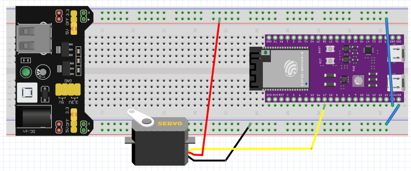

To control it from your Arduino sketch, you can use the ESP32Servo library. Install it via the Arduino Library Manager.

Open up the `File > Examples > ESP32Servo > Sweep` example, and change the pin number to the one you used for the signal wire. Upload the sketch, and you should see the servo sweeping back and forth.

### Ultrasonic sensor

Another intereseting sensor - that does require 5V power - is the ultrasonic distance sensor. It can measure distances by sending out an ultrasonic pulse and measuring the time it takes for the echo to return.

One of the most common ultrasonic sensors is the HC-SR04. It has four pins: VCC (5V), GND, Trig (trigger), and Echo.

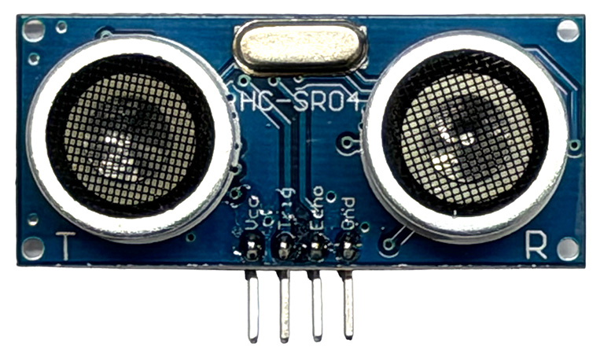

Hooking it up is also straightforward:
- Connect the VCC pin to the 5V rail on your breadboard
- Connect the GND pin to the GND rail on your breadboard
- Connect the Trig pin to a digital pin on the ESP32 (for example pin 13)
- Connect the Echo pin to another digital pin on the ESP32 (for example pin 12)

Install the NewPing library via the Arduino Library Manager, and open up the `File > Examples > NewPing > NewPingExample` example. Change the pin numbers to match your wiring, upload the sketch, and open the Serial Monitor. You should see distance measurements being printed out.

## Components to test

There's a whole world of components that work well with your board. Build and test the following examples, try to integrate them with a web application! Ask the lecturer for extra components if needed.

### Inputs

- Button: <https://docs.arduino.cc/built-in-examples/digital/Button>
- Photoresistor: <https://projecthub.arduino.cc/ccPegasus/photoresistor-brightness-sensor-519a6d>. You can use this to create a laser-tripwire (<https://projecthub.arduino.cc/polyhedra64/dynamic-laser-tripwirealarm-3544a8>), ask the professor for a laser diode to play with.
- Joystick: https://projecthub.arduino.cc/hibit/using-joystick-module-with-arduino-0ffdd4
- Rotary encoder: https://projecthub.arduino.cc/SURYATEJA/rotary-encoder-or-arduino-360-degree-encoder-f8cd8a
- Temperature & Humidity sensor: https://projecthub.arduino.cc/rudraksh2008/temperature-and-humidity-sensor-with-arduino-1d52a6
- Thermistor: https://projecthub.arduino.cc/Marcazzan_M/how-easy-is-it-to-use-a-thermistor-81ae74
- Piezo knock: https://docs.arduino.cc/built-in-examples/sensors/Knock/
- PIR motion sensor: https://projecthub.arduino.cc/electronicsfan123/interfacing-arduino-uno-with-pir-motion-sensor-593b6b
- RFID reader: https://www.instructables.com/Arduino-MFRC522-RFID-READER/
- Stretch Sensor: https://www.adafruit.com/product/519?srsltid=AfmBOoob-vlE-DSc4OlAYX_nOqxITjD9v5YpWqr_AHswMrUZBfphjXMl

### Outputs

- Piezzo sound: <https://docs.arduino.cc/built-in-examples/digital/toneMelody>
- DC motor: <https://learn.adafruit.com/adafruit-arduino-lesson-13-dc-motors/>
- Relay Module: https://arduinogetstarted.com/tutorials/arduino-relay
- 7-segment display: https://projecthub.arduino.cc/aboda243/get-started-with-seven-segment-5754a8
- 12V Led strip: https://www.instructables.com/ARDUINO-CONTROLLED-12v-RGB-LED-STRIP/
- 5V NeoPixel strip: https://learn.adafruit.com/adafruit-neopixel-uberguide/the-magic-of-neopixels

## Other things to check

- [VS Code Arduino Extension](https://marketplace.visualstudio.com/items?itemName=vsciot-vscode.vscode-arduino)
- [View Arduino, The documentary](https://vimeo.com/18539129) (28 min)
- [DIY Pressure Sensor](https://www.youtube.com/watch?v=_RUZtsQzSLY)
- [Star Wars Imperial March with Floppy and Arduino](https://www.youtube.com/watch?v=B_Q6jMUdfYc)
- [The breakfast machine](https://www.youtube.com/watch?v=E2evC2xTNWg)
- [Lunar Trails](https://vimeo.com/54043239)
- [NES Zapper Gun hack](https://vimeo.com/181220188)
- [NIghtwriter Nyx](http://www.gijsvanbon.nl/nyx1.html)
- [Whiteboard Clock](https://www.youtube.com/watch?v=4QgeQAiSmM8)
- [Neil Mendoza](http://www.neilmendoza.com/)
- [Anouk Wipprecht](http://www.anoukwipprecht.nl/gallery)
